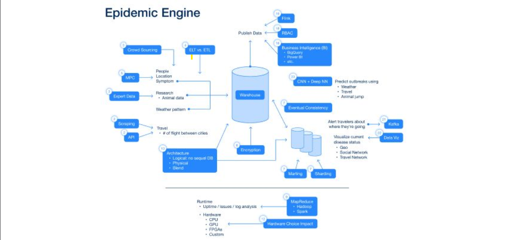

# Repo Link:
https://github.com/BU-CDS-DS539-2024-Spring/epidemic-engine-project-harshahrishavarunesh.git

Note: Reuploaded as the course repository fork visibility could not be set to public.

# Project Overview

  

# Project Documentation

# Steps to Run the Final Project
0.	Prerequisites: Ensure that Docker and Docker Compose are installed.
1.  Navigate to the 'final_project' folder using 'cd final_project'.
2.	Build and Run Services: Using the 'make final_project' command.
3.	Testing: Using the 'make test' command.
4.	Shutting Down: Using the 'make down' command.

# How to check the static website that serves the graphs
- After the docker-compose up is run through the makefile or on its own, you can check the static website on the following link: http://localhost/

# Project Files Overview
The extracted files include the following key components:
1.	Docker Compose (docker-compose.yml): Manages multi-container services for visualization, Kafka consumer, and machine learning.
2.	Dockerfiles: Each service has a dedicated Dockerfile:
-	Dockerfile.generate.website.visualisations: For generating the visualizations for the website
-	Dockerfile.kafka.consumer: For getting the data from the kafka producer and the 1m rows data csv for training ml model.
-	Dockerfile.ml.script: For running script for the machine learning tasks.
3.	Python Scripts:
-	generate_website_visualisations.py: Creates website visualizations.
-	kafka_consumer.py: Implements the Kafka consumer service.
-	ml_script.py: Contains script for the machine learning tasks.
-	pytest_script.py: Includes the pytest code for testing the health of the services we are running like kafka, nginx and postgres.
4.	Makefile: Automates build tasks and testing.
5.	Requirements: requirements.txt lists required Python libraries.
6.	Static Website: static_website folder has the skeleton html and css where it loads the graph plots generated by generate_website_visualisations.py script.

# Docker-compose Explanation and Usage
Explaining the following services
1. **db**:
   - **Description**: This is the postgres db which is used to persist the data. The database is "health_events_db" with tables "health_events_kafka_stream" from the kafka producer and "health_events_given_data" which is the given 1m row csv retrieved using requests library in python.
   - **Image**: `postgres:12.18-bullseye`
   - **Restart Policy**: `always`, meaning the service will always restart if stopped.
   - **Health Check**: Uses `pg_isready` to check if the database is accessible on port `5432`, with retries and timeouts configured.
2. **kafka_consumer**:
   - **Description**: A custom script to setup a kafka consumer to get the health_events, built from 'Dockerfile.kafka.consumer' Dockerfile.
   - **Depends On**: Relies on `db` and `kafka` services to be up before starting.
   - **Restart Policy**: `on-failure`, to restart only if the service fails, meaning data wasn't pushed to the postgres db.
3. **kafka**:
   - **Description**: Apache Kafka broker service, enabling message streaming.
   - **Image**: `docker.io/bitnami/kafka:3.7`
   - **Health Check**: Verifies connectivity to port `9092` by attempting to connect via TCP.
   - **Restart Policy**: `on-failure`, to restart only if the service fails.
4. **static_website**:
   - **Description**: An Nginx-based static website to serve data visualizations.
   - **Image**: `nginx:alpine`
   - **Health Check**: Uses `curl` to verify if the website is reachable on port `80`.
   - **Restart Policy**: `on-failure`, to restart only if the service fails.
5. **generate_visualisations**:
   - **Description**: A custom service to run script to get data from postgres db and generate data visualizations for the website, by saving them to the static_website directory. Built from 'Dockerfile.generate.website.visualisations' Dockerfile.
   - **Depends On**: Waits for `kafka_consumer` and `ml_train_predict` services to start first.
   - **Restart Policy**: `on-failure`, to restart only if the service fails, which would mean it would retry generating the graph images.
6. **ml_train_predict**:
   - **Description**: A machine learning training and prediction service, built from 'Dockerfile.ml.script' Dockerfile.
   - **Depends On**: Waits for `kafka_consumer` to be up first.
   - **Restart Policy**: `on-failure`, to restart only if the service fails.

### Volumes & Networks
- **Volumes**:
  - `kafka_data`: Stores Kafka data persistently using a local driver.
- **Networks**:
  - `kafka_default`: A custom bridge network shared among services for efficient inter-service communication.

# Makefile Explanation and Usage
The Makefile provides an automated way to build and manage the project using several key targets:
-	final_project: Builds and runs all services as defined in docker-compose.yml.
-	down: Stops and removes containers started by Docker Compose.
-  ml_predict_kafka: Can be used to make predictions on to be provided kafka broker ip and topic with the trained model
-	setup_env: Initializes and starts all services using Docker Compose.
-	test: Starts the environment using setup_env, then runs the test suite with pytest, and finally shuts down the services.

# Machine Learning
- The code sets up a machine learning pipeline using PySpark to predict potential health risks and anomalies in a dataset of health events. 
- First, it retrieves the data from postgres and initializes a Spark session with specific configurations. 
- It extracts relevant features such as time-based components and encodes categorical features like event type and location using StringIndexer. 
- A pipeline is created to handle data transformation and training with a Random Forest classifier. 
- The pipeline, combined with a cross-validator and hyperparameter tuning, is used to build two models: an anomaly detection model and a risk prediction model. 
- The trained models are evaluated using accuracy metrics and saved for future use. 
- Finally, the models are loaded to make predictions on test data, showcasing the ability to accurately identify anomalies and potential risks in the dataset.
* Model is stored in ml_model directory after the script is finished running which will store the model file in pkl form.

# Making Predictions with saved model through New Kafka Broker
- Dockerfiles and Scripts are defined in the ml_model directory in order to load the saved model that we trained on the given dataset and can be used to make prediction on new input form given kafka broker IP and Topic.
- This Kafka Broker IP and Topic needs to be edited in the ml_model/docker-compose-ml-predict.yml presen, which by default is the original kafka broker and topic used to make first predictions.
- To run the predictions, you can run the following command from the final_project directory - "make ml_predict_kafka".
- This will run the docker-compose file to run the script which loads up the trained ml model, does the feature engineering required on the input data and adds a predicted Is_Anomaly column to the given data.
- This input data with predicted Is_Anomaly can be found in postgres "health_events_db" db with the table name "health_events_kafka_stream_predicted_anomaly".

# Data Persistence
- The data from the provided csv and kafka producer is being persisted in a postgres db with following environment variables to check using DBeaver:
* pg_user = "root"
* pg_pass = "root"
* pg_host = "db"
* pg_port = 5432
* pg_db = "health_events_db"

